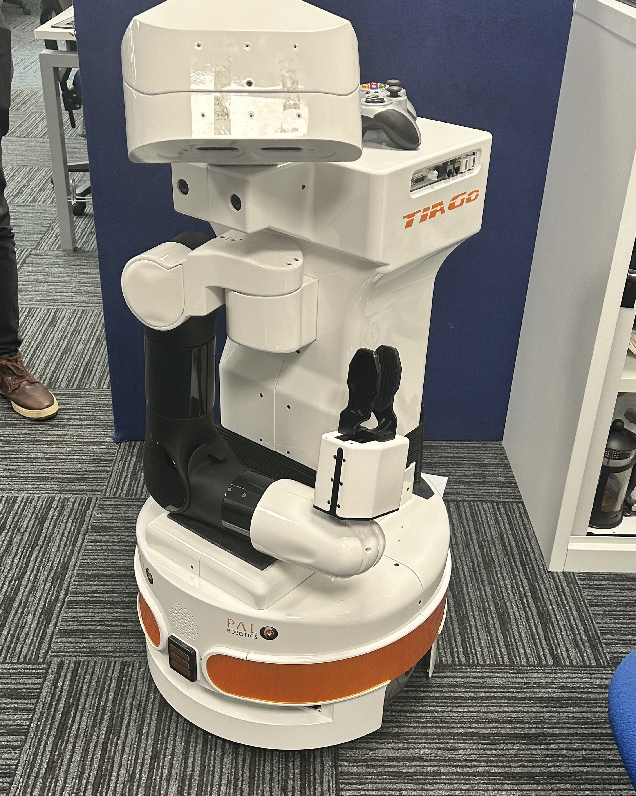
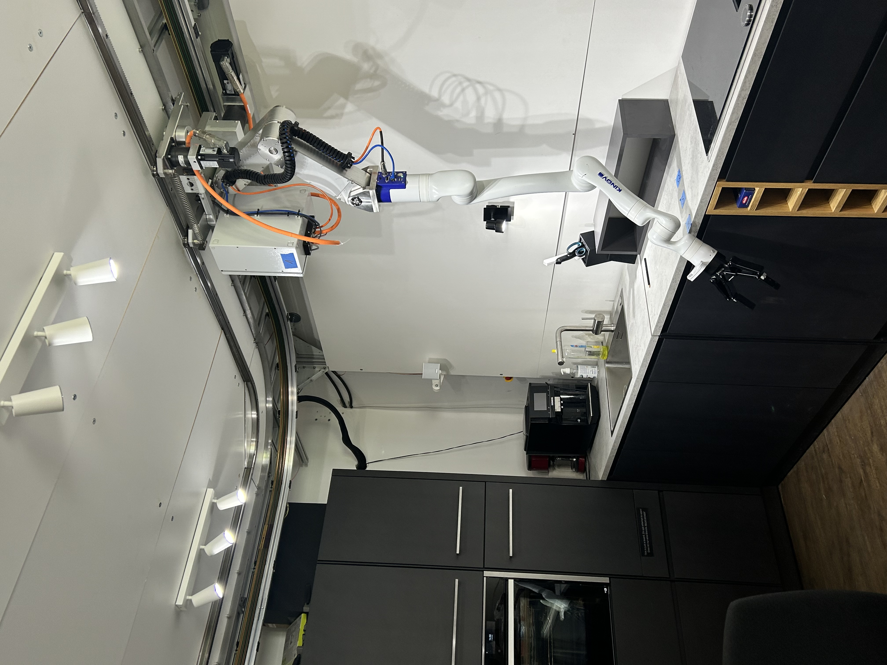

## Phuong Thu Ky Doan
---
3rd year Computer Science student @ University of Lincoln

Research intern @ Lincoln Institute for Autonomous System (University of Lincoln, England) & Media Informatics Group (LMU Munich, Germany)

---

## About Me
I am a 3rd year Undergraduate student in Computer Science at the [University of Lincoln](https://lincoln.ac.uk), working with Professor [Grzegorz Cielniak](https://staff.lincoln.ac.uk/e69a17de-0ef1-4771-8004-646967ea1ac9) at the [Lincoln Institute for Autonomous System (LCAS)](https://lcas.lincoln.ac.uk) on my bachelor's final project about interactive perception in robotics.

I am also collaborating with Dr. [Hao Xing](https://www.ce.cit.tum.de/air/people/hao-xing-m-sc/) from the [Institute for Cognitive Systems, Technical University of Munich (TUM)](https://www.ce.cit.tum.de/ics/home/) and doctoral researcher [Xuedong Zhang](https://www.medien.ifi.lmu.de/team/xuedong.zhang/) from the [Media Informatics Group, LMU Munich](https://www.medien.ifi.lmu.de/) on a project about 3D perspective taking in Human-Robot Interaction.

I am deeply passionate about robotics, especially enabling robots to perceive and understand their surroundings. I am seeking for a PhD opportunity in the field.

---

## Robot Platforms I had experience with

  
  

## 📬 Let's Connect!
- LinkedIn: [linkedin.com/in/kyptdoan](https://linkedin.com/in/kyptdoan)
- Email: ky.phuongthu.doan@gmail.com
- Website: [kyptdoan.github.io](https://kyptdoan.github.io)

